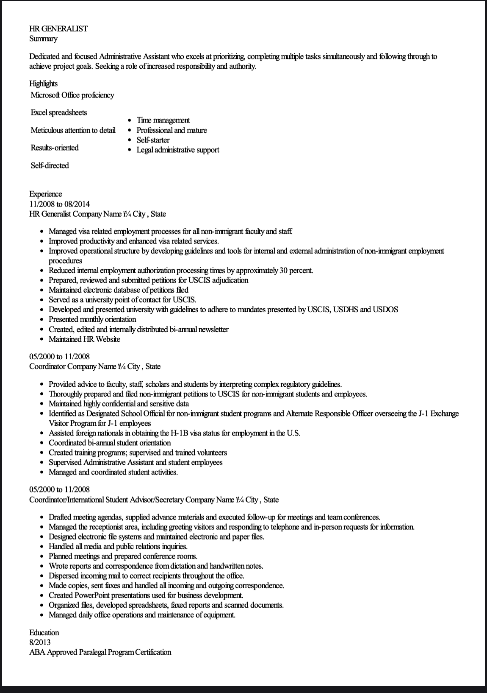
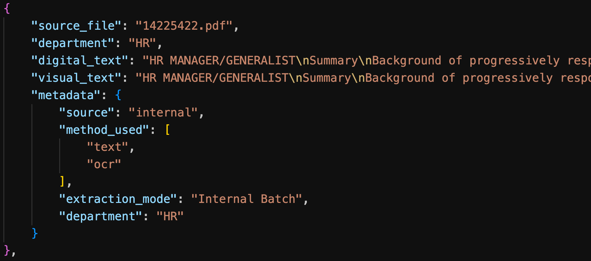
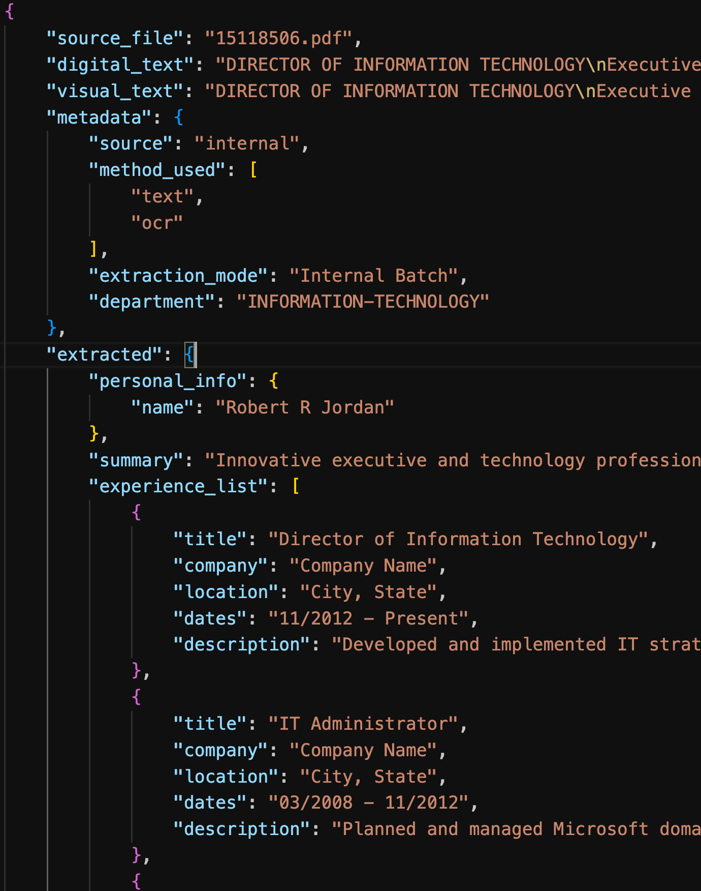
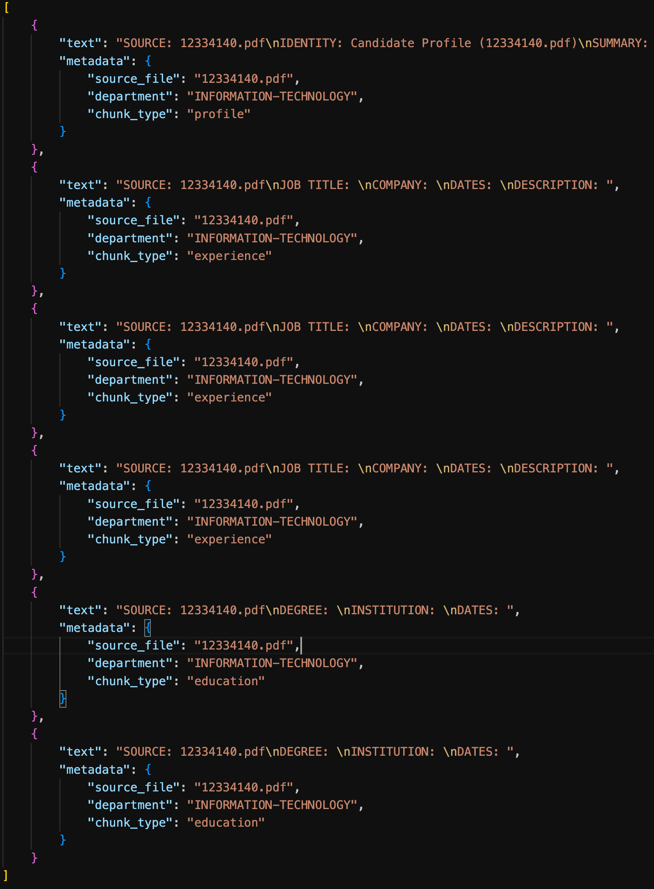

# AI CV Analysis & RAG Pipeline

Dự án này là một hệ thống phân tích và truy vấn hồ sơ ứng viên (CV) tự động bằng cách ứng dụng kiến trúc RAG (Retrieval-Augmented Generation). Hệ thống cho phép người dùng tìm kiếm thông tin ứng viên trong kho dữ liệu (HR/IT) hoặc tải lên một CV hoàn toàn mới để AI phân tích và trả lời câu hỏi trực tiếp.

## 🏗 Kiến trúc hệ thống (Workflow Pipeline)

Hệ thống được thiết kế thành các giai đoạn (Phases) xử lý tuần tự kèm với các tệp dữ liệu đầu ra:

### 1. Dữ liệu đầu vào (Raw Data)
- Kho dữ liệu CV thô ban đầu bao gồm các file PDF ứng viên.
- Danh sách thông tin cơ bản được liệt kê và đối chiếu thông qua file `Resume.csv`.

> **[Nội dung cụ thể quá trình xây dựng - Raw Data]** 
> Đầu vào dữ liệu thô bao gồm 2 file lớn HR và INFORMATION-TECHNOLOGY lần lượt bao gồm 110 CV và 120 CV.
> Đính kèm theo là 1 file Resume.csv đã được làm sạch chỉ còn lại 2 department vừa đề cập.
 

### 2. Phase 1: Ingestion (Trích xuất văn bản)
- Đọc và trích xuất nội dung từ các file PDF.
- Áp dụng cơ chế kép: Trích xuất **Text-based** (kéo chữ trực tiếp từ file digital) và kết hợp **OCR (Tesseract)** để xử lý các CV được scan dạng hình ảnh.

> **[Nội dung cụ thể quá trình xây dựng - Phase 1]** 
> Khu vực xử lý chính cho giai đoạn này nằm ở file  'src/ingestion' bao gồm 2 engine được hiện thực là ocr_engine và pdf_parser tương ứng với sử dụng pytesseract dành cho OCR và cơ chế đọc text và parsing ra cơ bản.
> Luồng xử lý sẽ thực hiện đều cả 2 phương pháp này trên cùng 1 file để tránh trường hợp áp dụng chỉ 1 phương pháp dẫn đến kết quả đầu ra là None. 
> Kết quả của quá trình này sẽ được lưu tại data/temp tương ứng với 2 file ingested_hr.json và ingested_information-technology.json
 

### 3. Phase 2: LLM Extraction (Cấu trúc hóa dữ liệu)
- Toàn bộ văn bản hỗn độn từ Phase 1 được đưa qua mô hình LLM **`qwen2.5:7b`** (chạy cục bộ thông qua Ollama).
- LLM sẽ phân tích và chuẩn hóa lại nội dung tuân thủ nghiêm ngặt theo bộ format JSON được định nghĩa trong `src/extraction/schema.py` (bao gồm Profile, Experience, Education, Projects).

> **[Nội dung cụ thể quá trình xây dựng - Phase 2]** 
> Mục đích cần để sắp xếp lại vì khi chunking ra cấu trúc viết CV của mỗi người sẽ có điểm khác nhau nên ở đây quá trình này giúp chuẩn hoá lại cấu trúc CV chung cho toàn bộ data.
> Đây là quá trình tốn nhiều thời gian chạy nhất khi thực hiện tự host mô hình chạy ngay trên máy do giới hạn phần cứng và tài nguyên về API để hỗ trợ.
> Ở đây sẽ phải trả giá khá cao khi mà file schema.py hiện tại chỉ được thiết kế tinh gọn và chưa đủ sâu đề đầu ra khi lưu tại chạy LLM thì thời gian inference sẽ nhanh hơn và thực hiện được trong thời gian khả thi hiện tại.
> Và đồng thời tại đây có 1 số trường hợp khi chạy inference ngay trên máy xảy ra việc LLM thực hiện việc này bị hallucination dẫn đến 1 số file cho ra kết quả khi extract không chính xác khi thông tin nằm hoàn toàn tại personal_info - ví dụ tại 24402267.pdf khi tìm kiếm tại file backend/processed/hr_extracted.json(Vị trí này em có xử lý riêng 1 file logs để ghi nhận lại trường hợp nhưng đã xoá rồi nên chỉ track nhanh lại sample này).
>Tuy nhiên số file bị mất được ghi nhận trong quá trình thực hiện là 2 file đối với HR và 3 file đối với IT nên hầu như thông tin được xử lý ổn thoả.


### 4. Phase 3: Semantic Chunking & Indexing
- Dữ liệu JSON sau khi được chuẩn hóa sẽ được **Semantic Chunking** (chia nhỏ theo cụm ngữ nghĩa) để đảm bảo không bị mất ngữ cảnh (Profile, Experience, Education, Project).
- Sử dụng mô hình **`nomic-embed-text`** để chuyển đổi các đoạn text này thành Vector (Embeddings).
- Lưu trữ toàn bộ Vector vào hệ thống cơ sở dữ liệu **ChromaDB**. (Tạo các Dynamic Collection theo `session_id` để phân lập dữ liệu).

> **[Nội dung cụ thể quá trình xây dựng - Phase 3]** 
> Quá trình này thực hiện embedding diễn ra khá nhanh chóng, đầu ra dữ liệu bao gồm 2 thứ là data/chunks chứa các chunk để thực hiện embedding và data/vector_db nơi lưu trữ lại các vector database từ quá trình embedding nhờ ChromaDB.
> Mỗi file sẽ có từ khoảng 5 đến 9 chunk.
> Ngay tại đây khi thực hiện kiểm tra lại dữ liệu được processed ra mới phát hiện vấn đề đề cập ở phase 2 và vì thời gian chạy lại phase 2 để thực hiện tìm lỗi là rất lâu và khá tốn máy cùng với xem xét lại số mẫu data bị Extract lỗi cũng tương đối ít nên thực hiện xử lý ngay bên trong chunker.py và chấp nhận sai số tại đây.


---

## 🧪 Đánh giá mô hình (Tiered Evaluation)

Hệ thống được thiết kế với Chiến lược Đánh giá Phân tầng (Tiered Evaluation) nhằm tối ưu cho phần cứng giới hạn (MacBook 16GB). Quá trình đánh giá được chia làm 3 Mode thông qua script `run_evaluation.py`:
- **Mode 1 (Retrieval):** Đánh giá độ chính xác (Exact Match Hit Rate) và độ trễ của ChromaDB mà không cần gọi LLM.
- **Mode 2 (Generation):** Micro-sampling qua Local LLM (Qwen2.5:7b) để đo End-to-End Latency.
- **Mode 3 (Cloud Judge):** Tối ưu bất đồng bộ (`asyncio` + `aiohttp`), offload việc chấm điểm sang Cloud API (Google Gemini 2.5 Flash) để đánh giá Answer Relevance (1-5 sao).

Hiện tại query được nhập vào từ các quá trình trên sẽ lấy thẳng ra từ trong context của data với mục tiêu abstract khi đánh giá là ngoài hiệu năng khi chạy thì chất lượng nó matching được kết quả và retrieve sẽ như thế nào?
> **[Nội dung cụ thể quá trình xây dựng - Evaluation]** 
>Mode 1 thực hiện việc viết script tự động đặt câu hỏi -> ChromaDB trả về các source_file hoặc chunk_id. Script chỉ việc so sánh: if retrieved_id == expected_id: score += 1. Với chi phí phần cứng: ~0%, tuy nhiên chỉ thực hiện chạy 50 câu hỏi để các mode sau có thể thực hiện trong thời gian khả dĩ.
>Mode 2 chọn ra 15 test chính xác từ Mode 1 sau đó thực hiện Inference end-to-end giống như mô tả trên
>Mode 3 chúng ta sẽ trực tiếp call thẳng API của GEMINI và cho nó thực hiện đánh giá câu trả lời có chính xác với trọng tâm câu query không và cho thang điểm từ 1 đến 5.
>****

==================================================
 KẾT QUẢ MODE 1: RETRIEVAL EVALUATION
==================================================
- Số mẫu test: 50
- Hit Rate (Chính xác): 58.00% (29/50)
- Độ trễ truy xuất TB: 0.1817 giây
- Đã lưu các câu hỏi Hit vào data/evaluation/mode1_hits.json
==================================================
📝 KẾT QUẢ MODE 2: GENERATION EVALUATION
==================================================
- Đã xử lý thành công: 15 mẫu
- Độ trễ End-to-End TB: 22.34 giây
- File kết quả: data/evaluation/eval_generation.json
==================================================
☁️ KẾT QUẢ MODE 3: CLOUD JUDGE EVALUATION
==================================================
- Số mẫu đã chấm: 15
- Điểm Relevance trung bình: 3.67 / 5.0
- Báo cáo chi tiết: data/evaluation/evaluation_report.csv

Ngoài ra có thể thực hiện đánh giá bám sát sâu hơn về chất lượng đầu ra ngay tại mỗi Phase thực hiện ở trên nhờ có file Resume.csv để có thể cải thiện hệ thống thêm ở từng Phase cụ thể. Như đối với phase 1 thì dùng các chỉ số như TFIDF và 1 số benchmark khác để xem nội dung được trích ra có giống với nội dung đề cập ở file Resume.csv không. Ở phase 2 thì có thể dùng 1 LLM khác mạnh hơn nữa để thực hiện đánh giá việc Extraction này có hallucination như trên và nội dung được đặt có đúng vị trí chính xác không.

Đồng thời ngoài ra khi chạy `scripts/test_system.py` thì một số test về complex query hệ thống vẫn chưa thực hiện được.
---

## 🚀 Hướng dẫn Triển khai (Deployment & API)

Dự án sử dụng mô hình **Hybrid Deployment** tách biệt Backend và Frontend, giúp tăng tính ổn định:
- **Backend (FastAPI & ChromaDB):** Được đóng gói Docker, chạy Local trên máy tính. Cung cấp các REST API cho tác vụ upload, truy vấn. Đặc biệt xử lý rác dữ liệu bằng hàm cleanup_orphan_collections trong `lifespan` FastAPI.
- **Frontend (Streamlit):** Web UI quản lý session người dùng, được host trực tiếp trên Streamlit Community Cloud (https://windycv.streamlit.app).
- **Kết nối (Ngrok):** Sử dụng Ngrok để tạo đường hầm (tunnel) an toàn từ Streamlit Cloud về Backend Local.

### Các lệnh vận hành:

**1. Khởi động Backend AI Server (Docker)**
Mở Terminal tại thư mục gốc và chạy lệnh:
```bash
# Xây dựng và chạy backend ngầm
docker compose up -d --build

# Tắt backend khi không sử dụng
docker compose down
```

**2. Mở kết nối Tunnel (Ngrok)**
Để Frontend trên Cloud có thể gọi về Backend Local, mở một Terminal mới và chạy:
```bash
ngrok http 8000
```
*Lưu ý: Sau khi chạy, copy URL HTTPS do Ngrok cung cấp và cập nhật vào biến `BACKEND_URL` trong file `frontend/app.py` và Push lên Github để Cloud tự cập nhật.*

**3. Khởi động Frontend Web UI (Chạy Local nếu muốn test trước)**
```bash
pip install -r frontend/requirements.txt
streamlit run frontend/app.py
```

### Các bất lợi còn tồn tại (Limitations & Trade-offs):
- **Phụ thuộc Ngrok URL:** Link ngrok thay đổi mỗi khi khởi động lại, đòi hỏi phải update thủ công vào code Streamlit mỗi ngày nếu không dùng bản trả phí.
- **Giới hạn phần cứng Local:** Quá trình Ingestion và Inference dùng `qwen2.5:7b` chạy tốn nhiều RAM. Việc đáp ứng truy vấn trực tiếp từ Cloud xuống máy cá nhân có thể gây thắt cổ chai hoặc treo máy nếu có nhiều session tải file cùng lúc.
- **Tính trạng mồ côi (Orphan Sessions):** Do Streamlit làm mới `session_state` mỗi khi người dùng tải lại trang web bằng F5, hệ thống sẽ mất dấu `session_id` cũ. Nếu user không chủ động bấm nút "Xóa CV", các collection tạm thời sẽ lưu lại ổ cứng. Một số giải pháp đã cố gắng thực thi nhưng đều chưa giải quyết được vấn đề này
- Chi tiết về quá trình chạy xem ngay tại link drive sau này: https://drive.google.com/file/d/1K63XPmrJE7k_pMw2KYUAWoapPg3_5s_a/view?usp=sharing 


